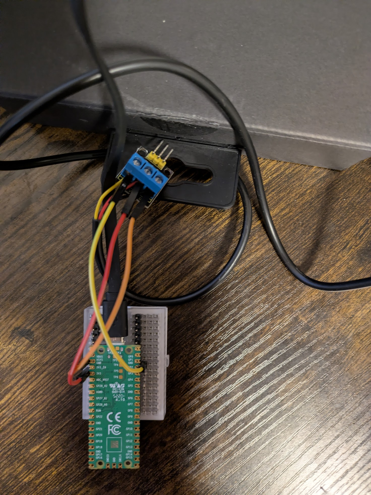

# DS18B20 am Raspberry Pi Pico

Diese Anleitung zeigt die Standard-Verkabelung eines DS18B20 mit dem Raspberry Pi Pico und einen schnellen Test im Terminal.

## Bauteile

- Raspberry Pi Pico (mit MicroPython)
- DS18B20 Temperatursensor (TO-92)
- 1x Widerstand `4.7 kOhm` (Pull-up)
- Breadboard + Jumper-Kabel

## Verkabelung (3-Draht)

DS18B20 Pins (flache Seite nach vorne, Beinchen nach unten):

1. links: `GND`
2. mitte: `DQ` (Daten)
3. rechts: `VDD`

Verdrahtung zum Pico:

- DS18B20 `GND` -> Pico `GND`
- DS18B20 `VDD` -> Pico `3V3(OUT)`
- DS18B20 `DQ` -> Pico `GP3` (frei waehlbar)
- Widerstand `4.7 kOhm` zwischen `DQ` und `3V3(OUT)`

Wichtig:

- Der Pull-up-Widerstand ist bei OneWire noetig, damit die Datenleitung sauber auf HIGH gezogen wird.
- Nutze fuer den Pico **3.3V**, nicht 5V.

## Foto der aktuellen Verschaltung



## Grafik: Pico-Pins und Breadboard (Keyestudio 170)

### 1) Pico-Pins (relevanter Ausschnitt)

```text
Raspberry Pi Pico (relevante Pins)

GP3      -> Datenleitung DS18B20 (DQ)
3V3(OUT)  -> Versorgung DS18B20 (VDD)
GND       -> Masse DS18B20 (GND)
```

Hinweis: Bei Pico/Pico W ist `GP3` der physische Pin `5`. `3V3(OUT)` ist Pin `36`.
`GND` kannst du jeden GND-Pin nehmen (z. B. Pin `18`, `23`, `38`).

### 2) Breadboard-Ansicht (170 Kontakte)

Beim 170er Breadboard sind die 5 Locher pro Seite einer Reihe verbunden:

- links: `A-E`
- rechts: `F-J`
- zwischen `E` und `F` ist der Mittelspalt (keine Verbindung)

Steckvorschlag (Beispiel mit Reihe `10`):

```text
170er Breadboard (Top-View)

A10 B10 C10 D10 E10   ||   F10 G10 H10 I10 J10
  |   |   |   |   |   ||     |   |   |   |   |
  +---+---+---+---+   ||     +---+---+---+---+
      (zusammen)       ||         (zusammen)

Sensor DS18B20 (flache Seite zu dir, Beinchen nach unten)

Bein links   (GND) -> E10
Bein mitte   (DQ)  -> E11
Bein rechts  (VDD) -> E12

Jumper zum Pico:
- E10 -> Pico GND
- E11 -> Pico GP3
- E12 -> Pico 3V3(OUT)

Widerstand 4.7 kOhm:
- ein Ende in E11 (DQ)
- anderes Ende in E12 (3V3)
```

Wenn du lieber einen anderen GPIO nutzen willst, nur `GP3` in Hardware und Code anpassen.

## Wie es funktioniert (kurz)

- Der DS18B20 nutzt den **OneWire-Bus** (eine Datenleitung + GND).
- Die Leitung ist als Open-Drain ausgelegt, deshalb braucht sie den Pull-up-Widerstand.
- Der Pico startet eine Temperaturmessung, wartet kurz und liest dann den Wert in Grad Celsius.
- Jeder DS18B20 hat eine eindeutige ROM-ID; mehrere Sensoren koennen auf derselben Datenleitung betrieben werden.

## Terminal-Beispiel (mit mpremote)

### 1) Interaktiver Test im MicroPython-REPL

```powershell
mpremote connect auto
```

Dann im REPL:

```python
from machine import Pin
import onewire, ds18x20, time

ow = onewire.OneWire(Pin(3))
ds = ds18x20.DS18X20(ow)
roms = ds.scan()
print("Gefundene Sensoren:", roms)

if roms:
    ds.convert_temp()
    time.sleep_ms(750)
    print("Temperatur:", ds.read_temp(roms[0]), "C")
```

## Einfacher Python-Import im Notebook

Das Backend liegt im Projektroot in `my_pico.py`.

```python
import my_pico

pico = my_pico.connect("auto")
temp = my_pico.get_temp(pico)
internal = my_pico.get_internal_temp(pico)

print(temp, internal)

my_pico.disconnect(pico)
```

Fuer schnelle Live-Messungen gibt es ausserdem:

```python
ds18b20_temp, internal_temp = my_pico.get_temps(pico, wait=0.2)
my_pico.toggle_led(pico)
```

`get_temp()` und `get_temps()` fuehren jedes Mal neu `convert_temp()` aus, damit ein frischer DS18B20-Wert gelesen wird.

### 2) Direkt aus dem PC-Terminal (ein Befehl)

```powershell
mpremote connect auto exec "from machine import Pin; import onewire, ds18x20, time; ow=onewire.OneWire(Pin(3)); ds=ds18x20.DS18X20(ow); roms=ds.scan(); print('ROMS', roms); (ds.convert_temp(), time.sleep_ms(750), print('TEMP_C', ds.read_temp(roms[0]))) if roms else print('TEMP_C', 'kein sensor')"
```

## Testdatei direkt starten

```powershell
mpremote connect auto run ds18b20/ds18b20_test.py
```

## Typische Fehler

- Kein `4.7 kOhm` Pull-up -> keine stabilen Messwerte oder kein Sensor gefunden.
- Falsche Pin-Nummer im Code (`Pin(3)` muss zu deiner Verkabelung passen).
- Sensor verpolt (Pin-Reihenfolge am TO-92 falsch gelesen).
- Kein MicroPython auf dem Pico oder keine USB-Verbindung.
